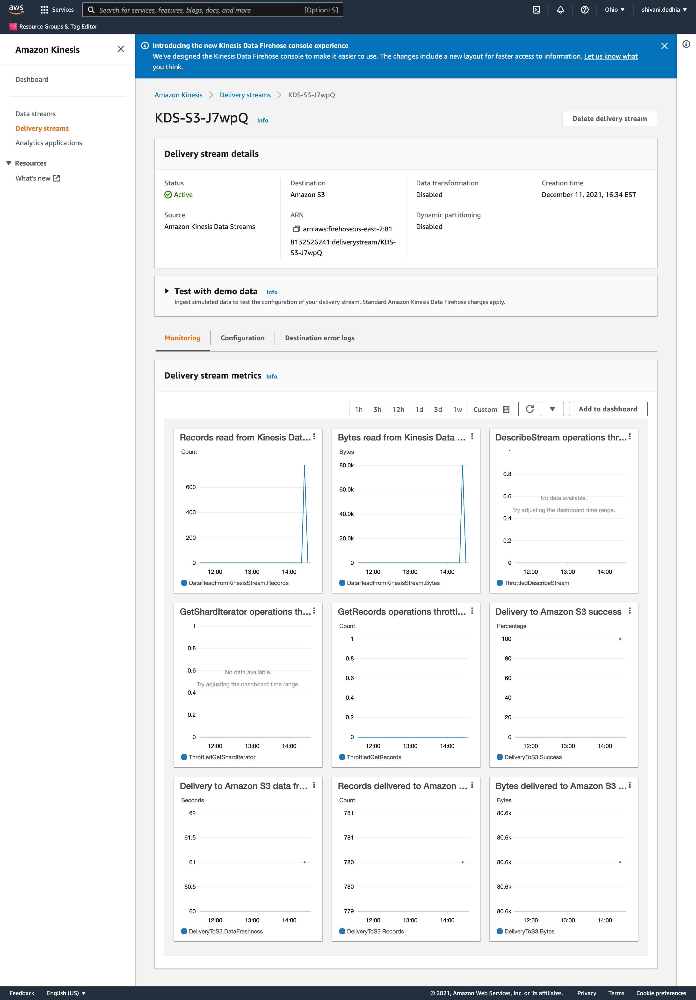

# Streaming Finance Data with AWS Lambda

This project provisions a Lambda function to generate near real time finance data records for downstream processing and querying. 

## Technologies

- AWS Lambda
- AWS Kinesis
- AWS S3
- AWS Glue
- AWS Athena

## Infrastructure

This project consists of three major infrastructure elements:
- A lambda function that collects our data 
- A lambda function that transforms and places data into S3 
- A serverless process that allows us to query our s3 data 

In the collector lambda I used the yfinance module to fetch stock prices ([documentation ](https://github.com/ranaroussi/yfinance)here)

One trading day’s stock prices HIGH and LOW for each company listed below on Nov 30th, 2021, at an five minute interval. 

- Facebook (FB)
- Shopify (SHOP)
- Beyond Meat (BYND)
- Netflix (NFLX)
- Pinterest (PINS)
- Square (SQ)
- The Trade Desk (TTD)
- Okta (OKTA)
- Snap (SNAP)
- Datadog (DDOG)

## Kinesis Data Firehose Delivery Stream Monitoring

